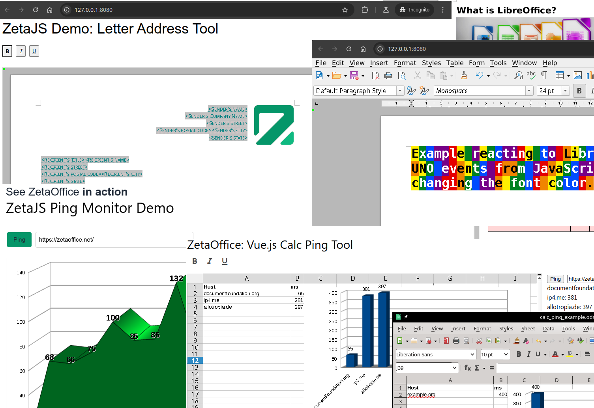

# zetajs: Access ZetaOffice in the Browser from JavaScript via UNO

The `zeta.js` library provides the facilities to run an instance of ZetaOffice integrated in your
web site, allowing you to control it with JavaScript code via the LibreOffice
[UNO](https://wiki.documentfoundation.org/Documentation/DevGuide) technology.

Use cases range from an in-browser office suite that looks and feels just like its desktop
counterpart, to fine-tuned custom text editing and spreadsheet capabilites embedded in your web
site, to a headless zetajs instance that does document conversion in the background.

For a detailed description of zetajs, see the [Starting Points](docs/start.md) documentation.

(Technically, `zeta.js` provides a wrapper on top of the
[Embind-based](https://blog.allotropia.de/2024/04/30/libreoffice-javascripted/) JavaScript scripting
capabilities for LibreOffice.  But it aims to provide a nicer, more idiomatic JavaScript experience,
and completely hides the underlying machinery.  In the future, it may even move away from that
underyling Embind layer, in a backward-compatible way.)

## Demo

To see a demo of zetajs in use, visit [zetaoffice.net/demo](https://zetaoffice.net/demo.html).



## Examples and test code

Check out the examples in the [examples](https://github.com/allotropia/zetajs/tree/main/examples) folder. We recommend to start with the [standalone](https://github.com/allotropia/zetajs/tree/main/examples/standalone) example.

Those examples are configured to run without requiring an own LibreOffice WASM (LOWA) build. They make use of the ZetaOffice CDN.

## Using ZetaOffice

Visit [zetaoffice.net](https://zetaoffice.net) to learn more about ZetaOffice, its CDN and how to host ZetaOffice yourself.

Using the official versions from [zetaoffice.net](https://zetaoffice.net) is the recommended way for most users. Only read on if you intend to build or debug LOWA itself.

## Why zetajs

See how zetajs makes scripting LibreOffice WASM easy:

### 1. Load a document

```javascript
const css = zetajs.uno.com.sun.star;
const desktop = css.frame.Desktop.create(zetajs.getUnoComponentContext());
let xModel = desktop.getCurrentFrame().getController().getModel();
if (xModel === null
    || !zetajs.fromAny(
        xModel.queryInterface(zetajs.type.interface(css.text.XTextDocument))))
{
    xModel = desktop.loadComponentFromURL(
        'file:///android/default-document/example.odt', '_default', 0, []);
}
```

### 2. Change each paragraph in Writer into a random color

```javascript
const xText = xModel.getText();
const xParaEnumeration = xText.createEnumeration();
for (const next of xParaEnumeration) {
    const xParagraph = zetajs.fromAny(next);
    const color = Math.floor(Math.random() * 0xFFFFFF);
    xParagraph.setPropertyValue("CharColor", color);
}
```

## Running the examples.

Some examples come with a package.json and can be run according to their README.md with npm. The other examples just need to put into a webserver with the following HTTP headers set.

```
Cross-Origin-Opener-Policy "same-origin"
Cross-Origin-Embedder-Policy "require-corp"
```

### Via uno_scripts in qt_soffice.html

Add this line right before `</body>` in `qt_soffice.html` and replace `EXAMPLE_FILE.js` with the example you choose.
Then add the mentioned files to the webroot.

```
    <script type="text/javascript">Module["uno_scripts"] = ['zeta.js', 'EXAMPLE_FILE.js']</script>
```

### Via building with EMSCRIPTEN_EXTRA_SOFFICE_PRE_JS

One way to run some of the provided example and test code is to serve those files next to `qt_soffice.html`, along with some `include.js` that looks like
```
Module.uno_scripts = [
    'zetajs/source/zeta.js',
    'zetajs/test/smoketest.js',
    'zetajs/examples/simple.js'];
```
(or whatever the paths where you serve them, relative to `qt_soffice.html`; `zeta.js` always needs to come first), and to build LOWA with an `EMSCRIPTEN_EXTRA_SOFFICE_PRE_JS=/path/to/include.js` configuration option (e.g., as a line in `autogen.input`), with `/path/to` adapted accordingly.  (The `test/smoketest.js` code requires a LibreOffice configured with `--enable-dbgutil` to have the `org.libreoffice.embindtest` UNOIDL entities available.)

## Using with an own WASM build

By default the exmaples load a precompiled ZetaOffice from https://cdn.zetaoffice.net/zetaoffice_latest/

You may have a look into the respective config.sample.js file of each demo to use another WASM build. You may compile an own [LOWA build](https://git.libreoffice.org/core/+/refs/heads/master/static/README.wasm.md). There the folder `workdir/installation/LibreOffice/emscripten/` will contain the files for the webroot. If the host the WASM binary on another origin then the example code you will need to set a [CORS header](https://developer.mozilla.org/docs/Web/HTTP/CORS).
